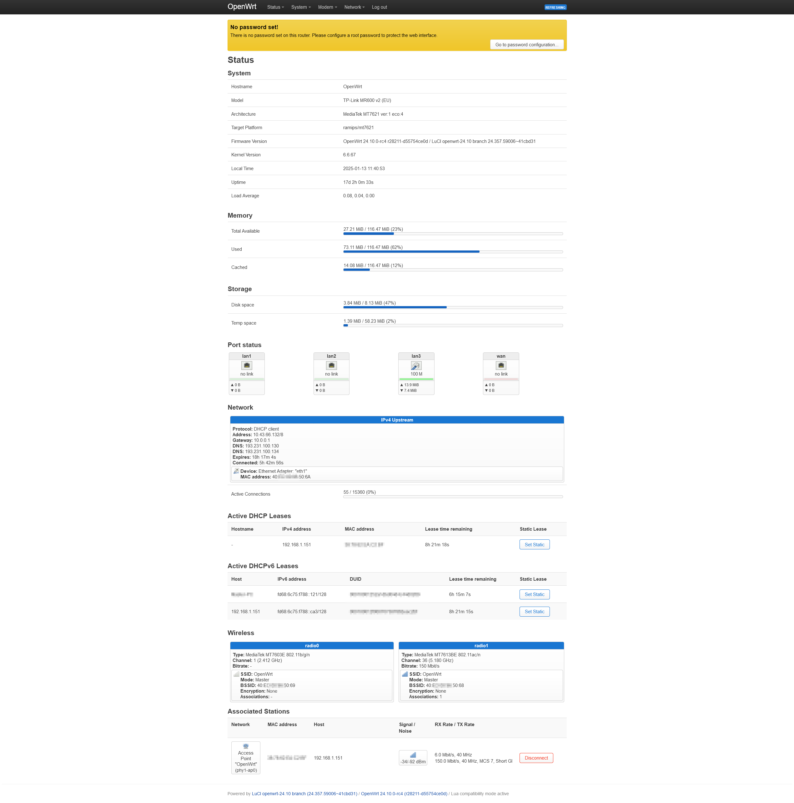

# OpenWrt on Tp-Link MR500v1 (EU)

Ever since I got this router I encountered connection stability issues (well reported on the Tp-Link forums 
[here](https://community.tp-link.com/en/home/forum/topic/649224), 
[here](https://community.tp-link.com/en/home/forum/topic/605538), 
[here](https://community.tp-link.com/en/home/forum/topic/616946), 
[here](https://community.tp-link.com/en/home/forum/topic/603938)...), and as soon as I took it apart and discovered it uses an OpenWrt supported platform (MT7621 / mipsel_24kc) I looked into finding a way to bring OpenWrt on it (and hopefully resolve the disconnection issues, or at least find a better workaround than scheduled daily router reboots). 

**The MR500 v1 (EU) is identical on first look with its (supported) bigger brother MR600v2, but uses a different LTE modem.**


_MR600v2 photo thanks to [kernelpanic1](https://forum.openwrt.org/t/tp-link-archer-mr600-exploration/65489/160)_

### Specifications

* SoC: [Mediatek MT7621DAT 880MHz](photos/PIC_20240106_200715.JPG)
* RAM: 128MB DDR3
* Flash: 16MB SPI NOR flash [(EN25)QH128A-104HIP](photos/PIC_20240106_200626.JPG)
* LTE Modem: [**Fibocom FG621-EA**](photos/PIC_20240106_200843.JPG)
* WiFi 5GHz: [Mediatek MT7613BEN](photos/PIC_20240106_200807.JPG)
* WiFi 2.4GHz: [Mediatek MT7603EN](photos/PIC_20240106_200817.JPG)
* Ethernet: MT7530, 4x 1000Mbps
* UART: [Serial console (115200 8n1) @ J1](photos/PIC_20240106_201317.JPG)
* Buttons: Reset, WPS.
* LED: Power, WAN, 4G+, single WiFi, LAN, Signal1, Signal2, Signal3 

Board photos: [front](photos/PIC_20240106_200401.JPG), [back](photos/PIC_20240106_200119.JPG), [serial pins](photos/PIC_20240106_201317.JPG). 

### Hardware

    # lspci
    00:00.0 PCI bridge: Device 0e8d:0801 (rev 01)
    00:01.0 PCI bridge: Device 0e8d:0801 (rev 01)
    01:00.0 Network controller: MEDIATEK Corp. MT7603E 802.11bgn PCI Express Wireless Network Adapter
    02:00.0 Unclassified device [0002]: MEDIATEK Corp. Device 7663

    # lsusb
	Bus 001 Device 001: ID 1d6b:0002 Linux 6.6.67 xhci-hcd xHCI Host Controller
	Bus 001 Device 002: ID 2cb7:0a05 Fibocom FG621 Module
	Bus 002 Device 001: ID 1d6b:0003 Linux 6.6.67 xhci-hcd xHCI Host Controller

### Identification

Since Tp-Link really enjoys versioning out their devices and mix-matching the hardware used in them it's necessary to first identify your device properly.

Software signature:


Hardware label:


_My device initially ran operator-specific firmware, hence the (ROORG) labeling._

---
> [!CAUTION]
> **Don't proceed unless you create full flash backups, are comfortable around flash programmers and/or bricked devices or can easily afford to buy a new router.**
> **Opening the device to access the serial console will also most likely void your warranty (and definitely break some/all plastic clips)**

## Installation

> [!IMPORTANT]  
> I have used **only** the serial console method as described in the [MR600 commit message](https://git.openwrt.org/?p=openwrt/openwrt.git;a=commitdiff;h=78110c3b5fce119d13cd45dadd33ca396c8ce197) to install OpenWrt on the MR500.  
> While a `factory` image exists, the ~~MR600 does not have a device page yet so I cannot confirm if it is possible to install OpenWrt directly from the Tp-Link web interface~~ [MR600 device page](https://openwrt.org/toh/hwdata/tp-link/tp-link_archer_mr600_v2) links to the initramfs image for factory install, so it is probably not possible to install OpenWrt directly from the Tp-Link web interface. Perhaps [this discussion](https://forum.openwrt.org/t/tp-link-archer-mr600-exploration/65489?page=5) holds the complete answer.
> Even if that is already supported, the same `factory` image may or may not work with MR500's OEM web interface to allow for firmware migration. 

**1.** Start a TFTP server - [Tftpd64](https://pjo2.github.io/tftpd64/) will do just fine.

Configure the computer's network adapter and the TFTP server to listen on 192.168.0.5/24. Connect to the router using one of the 3 LAN ports.

**2.** Download the MR600v2 OpenWrt initramfs (kernel) image from the [OpenWrt Firmware Selector](https://firmware-selector.openwrt.org/?target=ramips%2Fmt7621&id=tplink_mr600-v2-eu) (either 23.05.x or 24.10.x will do)

Place it into the TFTP server's root directory and rename it to `test.bin`

**3.** Connect to the router's serial console with a USB/UART adapter.

If you want to poke around the Tp-Link firmware first, the login credentials are _admin / 1234_

Attach power and interrupt the U-Boot boot procedure when prompted (type `tpl`).

```
U-Boot 1.1.3 (Nov 22 2023 - 16:37:42)

Board: Ralink APSoC DRAM:  128 MB
relocate_code Pointer at: 87fa0000

Config XHCI 40M PLL
******************************
Software System Reset Occurred
******************************
flash manufacture id: 1c, device id 70 18
find flash: EN25QH128A
*** Warning - bad CRC, using default environment

============================================
Ralink UBoot Version: 5.0.0.0
--------------------------------------------
ASIC MT7621A DualCore (MAC to MT7530 Mode)
DRAM_CONF_FROM: Auto-Detection
DRAM_TYPE: DDR3
DRAM bus: 16 bit
Xtal Mode=3 OCP Ratio=1/3
Flash component: SPI Flash
Date:Nov 22 2023  Time:16:37:42
============================================
icache: sets:256, ways:4, linesz:32 ,total:32768
dcache: sets:256, ways:4, linesz:32 ,total:32768

 ##### The CPU freq = 880 MHZ ####
 estimate memory size =128 Mbytes
#Reset_MT7530
set LAN/WAN WLLLL                                                             

				 <--- around here type 'tpl' quickly

4: System Enter Boot Command Line Interface.

U-Boot 1.1.3 (Nov 22 2023 - 16:37:42)
MT7621 #
```

**4.** Transfer the firmware [via TFTP](logs/tftp-flash-log.txt) and then instruct U-Boot to boot OpenWrt from ram:

```    
# tftpboot

...transfer happens here...

# bootm
```

The router will boot the kernel image and start OpenWrt in _recovery mode_.
	
**5.** With OpenWrt booted in **_recovery (initramfs)_** mode, use the web interface or console to install the `sysupgrade` OpenWrt firmware (which you can also obtain from the ImageBuilder).

After another reboot you should find yourself in the permanently installed OpenWrt firmware.

### Status

**What works:**
- WAN and LAN 1-3 ports are correctly identified and work as expected.
- Both 2.4Ghz and 5Ghz wirelesses are recognized and functional (I didn't do throughput tests as I mostly focused on getting the mobile connection up and running, which provides nowhere near the wireless bandwidth capabilities).
- LEDs are all functional (and also configurable through LuCI):
	- Power, WAN, LAN and WIFI work out-of-the-box. The single WIFI led is attached to the 5Ghz wireless by default, but can be reassigned in LuCI.
	- The 4G+ led can be configured to indicate WWAN status (but no longer differentiates between 4G and 4G+ connectivity as with the retail firmware).
	- _The mobile signal leds are a task for another day._
- Individual signal numbers seem in the correct range, but I have no precise way of confirming them.
- At least some of the LTE status info is confirmed correct (Operator, MCC, NMC, Cell ID, Primary band, Modem firmware model and version).
- Carrier aggregation and second band info works ([(1)](images/3ginfo-CA-3&20.png), [(2)](images/3ginfo-CA-7&20.png)) with the patched [3ginfolite script](lte-advanced/usr_share/3ginfolite/3ginfo.sh). 
	- Speeds are on par with another MT7621-based router running a Qualcomm EM12 modem placed side by side and on the same mobile operator and identical data plan.

**What doesn't work:**
- So far everything seems to work for basic functionality. Advanced LTE monitoring and band selection require additional steps as described below. 
	- ~_Secondary band functionality and reporting need to be tested with a CA-capable SIM/operator._~
	- 3ginfo status page fails randomly and after being left open and refreshing for a while. Force refreshing several times or logging out of LuCI and logging back in seems to return it to functioning order. I assume either the modem is slow to respond or randomly returns unexpected or garbage data. 
- Stability improvements remain to be tested... Watchcat can easily handle the modem restarts if it misbehaves like with the official firmware. 

**Updates:**
- 17 days in the router remains online, but carrier aggregation doesn't seem to kick in anymore (similar to what the router does with the official firmware). Restarting the modem with `AT+CFUN=15` restores carrier aggregation and improves speed slightly. 
- 25 days in, the router is still online, wwan lost connection and reconnected a couple of times (and reset its uptime) but didn't complete become unresponsive as with the default firmware (yet). Additionally, the 5Ghz signal level appears to be on the low-side with just half the bars on a phone a few meters away in the same room. One oddity is that the modem appears to do some kind of half NAT of its own, with the wwan connection always using a gateway of 10.0.0.1 (which is also a hop in the traffic), which doesn't exist on other routers with the same SIM/ISP. 



> [!NOTE]
> My modem is running firmware version `16121.1009.00.01.02.13` as installed by the `1.7.0 0.9.1 v0001.0 Build 231122 Rel.61263n_Beta` *beta* firmware. The latest non-beta firmware available at [Tp-Link](https://www.tp-link.com/en/support/download/archer-mr500/#Firmware) reverts the modem firmware to `16121.1009.00.01.02.12`. With other versions your results may vary from mine.

---
## LTE

> [!IMPORTANT]  
> The Fibocom FG621 modem runs in NCM mode (internally [mode 36](usb-modes.md)) not QMI as the Qualcomm modem on MR600 does, so the initial WWAN network setup is incorrect.

_This step is easiest to do with wired WAN connectivity since LTE is not functional yet_

Use the package manager to install
	
    luci-proto-ncm
	
This will in turn also install the required dependencies:

	chat
	comgt
	kmod-usb-serial
	kmod-usb-serial-wwan
	kmod-usb-serial-option
	kmod-usb-net-cdc-ether
	kmod-usb-net-cdc-ncm
	kmod-usb-net-huawei-cdc-ncm
	comgt-ncm
	 
Reboot the router. After the reboot there is a new network device `eth1` available.

Use LuCI to delete or edit the pre-configured `wwan0`.  
Create a `wwan0` interface with protocol `DHCP` and attached to the new `eth1` device.  
Or do this manually in `/etc/config/network`:

	config interface 'wwan0'
		option proto 'dhcp'
		option device 'eth1'


The modem should automatically work out the required APN from the SIM/network (at least it did for me - but I had it configured and working with this network operator in the official firmware before so that may play a part).  
To see the existing APN/PDP configuration, the `AT+CGDCONT?` AT command in `picocom /dev/ttyUSB0` can be used.

At this point the mobile connection should be up and running (check if the wwan0 interface receives an IP address from the ISP, usually in the 10.x.x.x range). This process may take up to several minutes after a (re)boot or a modem restart. 

> [!NOTE]
> If the modem happens to be non-responsive, try the commands suggested in the [4G-AX56 commit message](https://git.openwrt.org/?p=openwrt/openwrt.git;a=commitdiff;h=502916468e2871f7f19b14b521a10ebf28394006) (which uses the same modem):  
> `echo -e "AT+GTAUTOCONNECT=1\r\n" > /dev/ttyUSB0`  
> `echo -e "AT+GTRNDIS=1,1\r\n" > /dev/ttyUSB0`  

### Advanced LTE

For signal monitoring and band selection/locking **4IceG**'s awesome [luci-app-3ginfo-lite](https://github.com/4IceG/luci-app-3ginfo-lite) and [luci-app-modemband](https://github.com/4IceG/luci-app-3ginfo-lite) will do miracles.  
However, the Fibocom modem is not supported in the current (as of December 2024) builds and will require a bit of manual tinkering. 

The install processes for both are best described in their respective repos, but for convenience I have included the versions I successfully tested and modded in the [`lte-advanced/`](lte-advanced/) folder on this repo (in the appropriately numbered order).
Download and use random files off the internet at your discretion.

In the same folder are also the necessary tweaked and new files that are required for modem support.

#### 3ginfo-lite

1. Install the appropriate architecture `sms-tool` ipk.

2. Install `luci-app-3ginfo-lite` ipk. 

Force refresh or logout/login to LuCI and navigate to the **Modem > Information ...** submenu.  
Switch to the **Configuration** tab and set:

- _Interface_ option to `wwan0`
- _Port for modem_ to `/dev/ttyUSB0

Save and Apply.

You'll notice there is still no information on the **Details** tab. 

3. Patch `/usr/share/3ginfo-lite/3ginfo.sh` using SCP or the console according to [these changes](https://github.com/4IceG/luci-app-3ginfo-lite/compare/main...thezedt:luci-app-3ginfo-lite:fg621?diff=split&w=#diff-bfb9df31e7c9175e9d10b5dca27891b6c20b9997ed0df263b257f34796d5067a).

4. Inside the `/usr/share/3ginfo-lite/modem/` subfolder create a new file named **`2cb70a05`** (the VID/PID of the modem) with [this content](https://github.com/4IceG/luci-app-3ginfo-lite/compare/main...thezedt:luci-app-3ginfo-lite:fg621?diff=split&w=#diff-81e9e3e254e33b574ed506eb3df71e979e8ca6c33126616a4eecc5c9050dbe60).

Once both files are edited/created successfully, the details should finally be displayed in LuCI (after a while or a refresh).


#### modemband

1. Install the `modemband` apk.

2. Install `luci-app-modemband` apk. 

Force refresh or logout/login to LuCI and navigate to the **Modem > Prefered Bands** submenu.  
Switch to the **Configuration** tab and set:

- _Interface_ option to `wwan0`
- _Port for modem_ to `/dev/ttyUSB0`
	
If you choose to enable modem restart after bands change, to ensure successful change adjust the preset restart command to:

	AT+CFUN=15

Save and Apply.

You'll notice an error message and lack of information on the **Preferred LTE bands** tab.

3. Use SCP or the console to explore the router's filesystem and navigate to `/usr/share/modemband/`.

Inside create a new file named **`2cb70a05`** (the VID/PID of the modem) with [this content](lte-advanced/usr_share/modemband/2cb70a05).

Complete modem initialization after a band change can take up to several minutes, so be patient if the information pages don't work for a while (even if the mobile connection is working). 


#### Signal level LEDs

Probably starting from [this script](https://forum.openwrt.org/t/cellular-signal-level-indicator/60543/15), adapt it to read signal level with AT commands instead of (unavailable) `uqmi`. `3ginfo-lite` should be able to provide the inspiration for this. 

### MR500 v1 specific OpenWrt build

I'm aiming to test the router (and modem) stability for about a month of uptime (that's about the maximum connection uptime I've had with the official beta firmwares before connectivity went bust) before putting the extra work in for the next steps.  

> [!TIP]
> While a dedicated firmware build for MR500v1 would be nice, if you don't care for the incorrect labelling in LuCI you can use the [OpenWrt Firmware Selector](https://firmware-selector.openwrt.org/?target=ramips%2Fmt7621&id=tplink_mr600-v2-eu) right now to build a MR600-based firmware that's usable out-of-the-box (and also after a configuration reset).  
> Simply select the desired OpenWrt release (from those available), then customize the packages list to include`luci-proto-ncm` (the builder will handle the necessary dependencies). You can remove the two existing _qmi_ packages to same some space.  
> Then pre-configure the `wwan` network interface using the **first boot (uci-defaults)** script:  
> `uci set network.wwan0=interface`  
> `uci set network.wwan0.proto='dhcp'`  
> `uci set network.wwan0.device='eth1'`  
> `uci commit network`  
> Finally build and download the custom `sysupgrade` image and use it to flash the router at the second step.