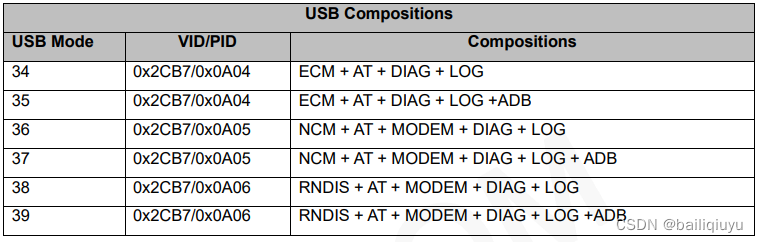
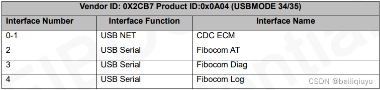
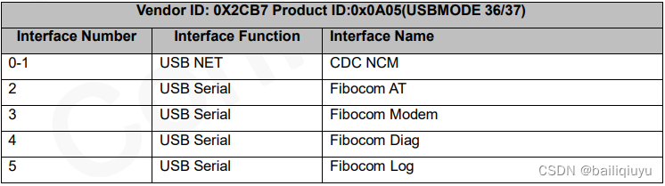
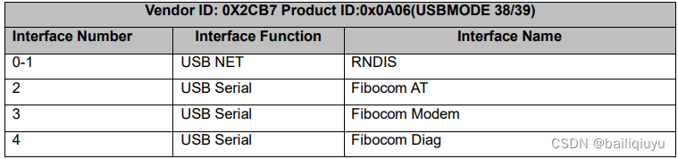
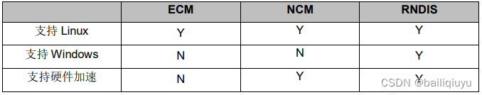

By default the Fibocom FG621-EA in the Tp-Link MR500v1(EU) is configured to work in NCM mode (Fibocom-designated mode 36).

	root@OpenWrt:/# picocom /dev/ttyUSB0
	picocom v3.1

	port is        : /dev/ttyUSB0
	flowcontrol    : none
	baudrate is    : 9600
	parity is      : none
	databits are   : 8
	stopbits are   : 1
	escape is      : C-a
	local echo is  : no
	noinit is      : no
	noreset is     : no
	hangup is      : no
	nolock is      : no
	send_cmd is    : sz -vv
	receive_cmd is : rz -vv -E
	imap is        :
	omap is        :
	emap is        : crcrlf,delbs,
	logfile is     : none
	initstring     : none
	exit_after is  : not set
	exit is        : no

	Type [C-a] [C-h] to see available commands
	Terminal ready
	AT
	OK

	AT+GTUSBMODE?
	+GTUSBMODE: 36

	OK

	AT+GTUSBMODE=?
	+GTUSBMODE: (34-39)

	OK 
	
The current mode is verified with:

	AT+GTUSBMODE?

Theoretically, the modem can be switched between its supported modes using AT commands:

	AT+GTUSBMODE=xx

Where **_xx_** can be any of the numbers listed in the table below.  
Before making changes, write down the current mode value and check if the desired mode is in the accepted list for your particular device:

	AT+GTUSBMODE=?

**USB Modes**

**ECM Mode**

**NCM Mode**

**RNDIS Mode**

**OS Support**

I have not personally tested mode switching on this specific modem. This information is saved here for reference only. 

Source: [(1)](https://blog.csdn.net/bailiqiuyu/article/details/124489444)